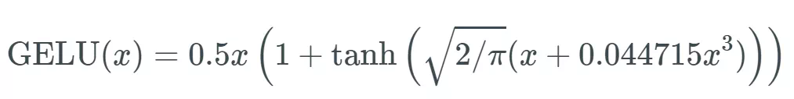
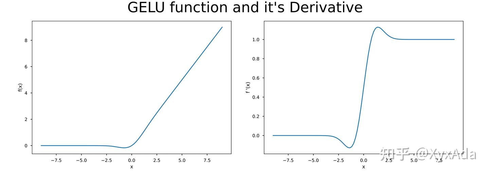
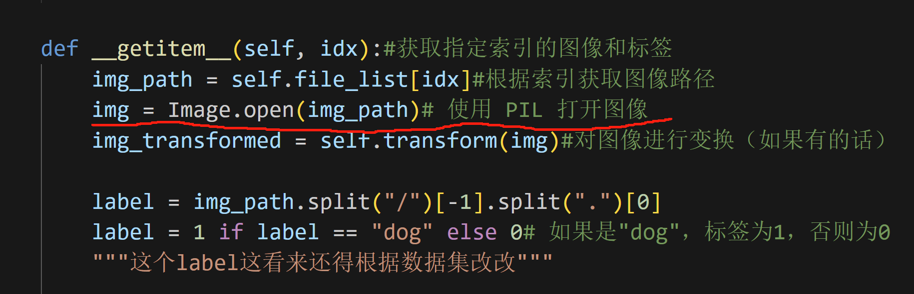

### Dropout
Dropout 是一种正则化技术，用于防止神经网络过拟合。它在训练过程中随机“丢弃”（即设置为零）网络中的一些神经元，这意味着在每次迭代中，网络都会以不同的方式学习数据。
#### 与bn层的关系：
虽然 Batch Normalization (BN) 层不能直接替代 Dropout，但它们都是为了提高神经网络的性能和泛化能力而设计的。

Batch Normalization：BN 层通过对每个小批量数据进行归一化来加速训练过程，并允许使用更高的学习率。它通过减少内部协变量偏移（Internal Covariate Shift）来提高训练的稳定性。
与 Dropout 的关系：BN 和 Dropout 可以同时使用，它们有不同的作用。BN 改善了梯度的流动，而 Dropout 通过随机丢弃神经元来减少过拟合。

### GELU激活函数
Gaussian Error Linear Unit（GELU）是一种在深度学习中常用的激活函数，它在许多神经网络模型中表现出色，尤其是在自然语言处理（NLP）领域，例如在 Transformer 架构中。函数公式：

看公式感觉很唬人啊，直接看函数图像吧。

左边就是GELU的函数图像，右边是其导数图像。
可以看出，当x越大的时候，就越有可能被保留，x越小就越有可能被归置为0.
*看图像，总感觉就是个ReLU的进阶版本罢了*

### PIL打开图像
```
from PIL import Image
```

在代码中使用 PIL（Python Imaging Library）打开图像的原因主要是因为 PyTorch 的 ToTensor() 等数据变换操作通常需要输入图像是一个 PIL 图像对象或 NumPy 数组。具体来说，直接读取图像的路径（比如使用文件路径字符串）并不能直接进行图像处理


