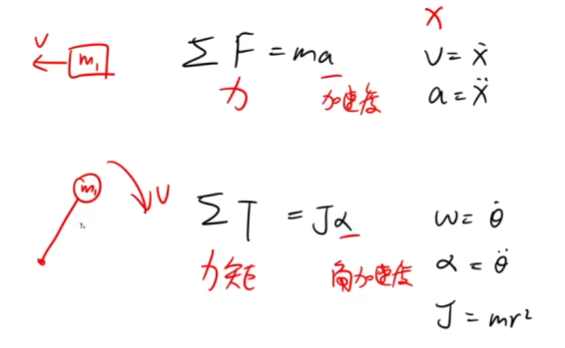
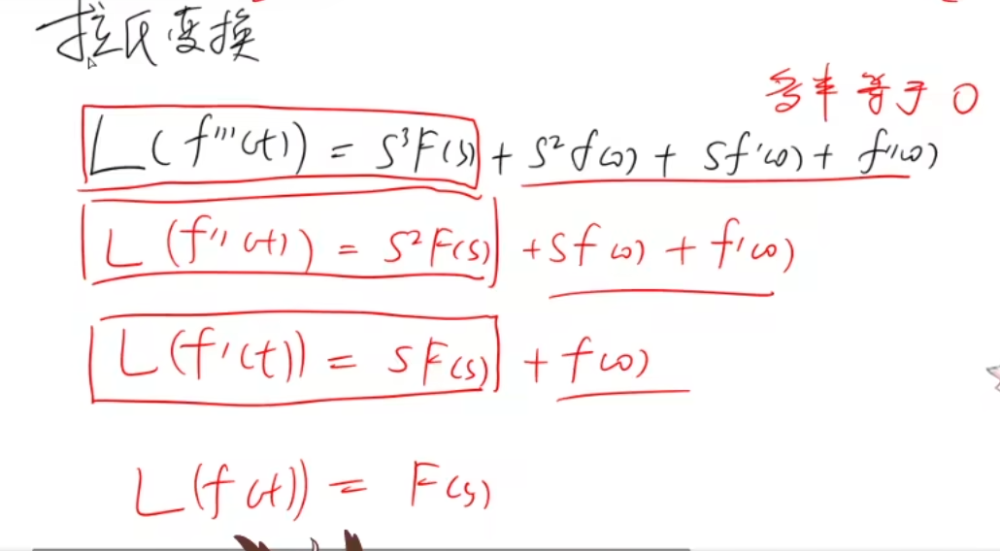

# 自动控制——chapter0
## 基础知识初级补全计划
### 阻尼器
有一个阻尼器的东西，长相大约与下图红色部分类似。  

对于阻尼器有一个公式就是图中的黑色部分，F=fv  
F就是图中的F（两个F的力是相等的），f为系数，v为缸体与活塞的相对速度（缸体与活塞不是专业词汇，只是我凭感觉这么叫而已）

### 力与运动

上面的一套公式自然不必多说，是针对平移的情况（也是高中所接触学习）的一套。
其中求和符号应该就是指得合力的意思，F为受力，m为物体质量，a为加速度。
往右看，x代表位移，v即为x对t的一阶导，a即为x对t的二阶导。

下面的一套是新东西。
针对的是旋转的情况，T叫做力矩，α叫做角加速度，J叫做转动惯量。

转动惯量的计算公式为J=mr^2，其中r代表的是旋转的半径。
其他右边的公式类比上方的会更好理解。其中，θ为转过的角度。
同理，w角速度为θ对t的一阶导，α为θ对t的二阶导。  
 
还有个额外模型看一下，如图

把这个图中像轮子的部分想象成轮子，它有一个角速度w，然后上面那个固定的，轮子贴在一起的，跟刹车片一样的东西（但这里的刹车片应该是没有施加压力的）。
公式所求的就是“刹车片”与轮子之间的摩擦力（应该是这个意思吧（笑））。

### 拉氏变换

这个我看的网课并没有展开讲，于是乎去问了一下ai，以下是查出来的内容精简：  
拉普拉斯变换（Laplace Transform）是一种数学变换，它将一个在时间域（或时域）中定义的函数转换到复频域（或s域）。这种变换对于解决工程和物理学中的微分方程特别有用，尤其是在控制理论、信号处理和系统分析等领域。
#### 时间域与复频域
· 时间域
时间域是描述信号或系统随时间变化的方式。在时间域中，我们关注的是信号如何随时间t变化，即信号是时间的函数。例如，一个电信号可以表示为v(t)或i(t)，其中t表示时间，v和i分别表示电压和电流。
·复频域
复频域是一种通过拉普拉斯变换或傅里叶变换将时间域信号转换到的一种频域表示。在复频域中，信号被表示为复变量s的函数，其中s = σ + jω，σ是实部，ω是虚部，j是虚数单位。
##### 关于频域（初级理解分条）
1.这玩意好像是专门针对信号的处理的，分为实部和虚部
2.实部通常代表信号的能量或振幅的频率分布。
3.虚部的物理意义
虚部与实部相位差90度，它通常与信号的相位信息有关。

# 其他
其实提到了电感与电容的一些相关公式（带有微分符号的），不过暂时未展开，日后遇到在做详查~~