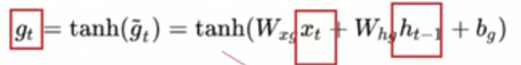

# LSTM
LSTM（长短期记忆网络，Long Short-Term Memory）

## 提出思路
RNN：想把所有的信息都记住。
LSTM：设计一个记忆细胞，具备选择性记忆的功能，可以选择记忆重要信息，过滤噪声信息，减轻记忆负担。

## 前向传播
这应该可以理解为网络的整体结构图概览：

关键是

#### 接下来是关于上图的讲解：
我们的视角从Xt与ht-1（图中左下角）开始看。

这是得到ft，gt，与it的过程**其中gt对应的图中的C撇t**
然后是得到Ct的过程，
首先是将 c~t-1~与ft做一个逐元素相乘，将gt与it进行逐元素相乘。
将二者所得结果相加即可得到ct。

ok，关于c~t~的相关讲完了，接下来是h~t~：（对应图中绿色虚线框部分）

这样搞完的h~t~有两个流向,其一就是输出（对应图中往上的紫色的部分），其二就是继续作为下一时刻的输入（对应图中往右的军绿色部分）。
当使其作为输出的时候，可以灵活处理，比如说，最终整个二分类问题，就可以搞如下：

## 原理解析

记忆细胞对应的部分就是上图所示的部分了。
不过一般是将其分为三个部分来理解的：

### 遗忘门
对应图中红色虚线部分。
由X~t~和h~t-1~计算得到的f~t~（经过sigmoid了），与C~t-1~逐元素相乘，这样可以对过去的知识（C~t-1~）进行选择，我们是希望其遗忘对当下时间点t不重要的部分。
### 更新门（输入门）
对应图中蓝色虚线部分。
经过计算所得的C撇~t~，可以理解为生成的新知识，经过i~t~的筛选加入经过遗忘门的C~t-1~，从而得到C~t~
### 输出门
对应图中绿色虚线部分。
将C~t~理解为至今为止所获得的知识相关，走过tanh激活函数之后提炼成为处理事务的能力，然后在经过一个筛选o~t~，最终得到输出h~t~。

## 其他
大概就是这么个情况，看看吧~~~希望有用。