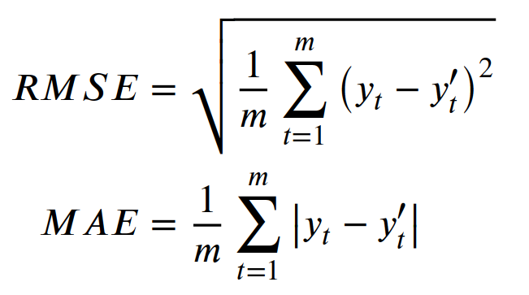
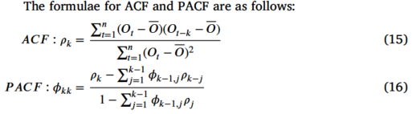

# 基础概念一览
## WFGD（湿法烟气脱硫）
WFGD是“湿法烟气脱硫”（Wet Flue Gas Desulfurization）的缩写。  
大致过程如下：
1.捕捉烟气：当燃煤电厂燃烧煤炭发电时，会产生含有二氧化硫的烟气。这些烟气在排放到大气之前，会被引导进入WFGD系统。
2.石灰石-石膏法：WFGD系统中常用的方法之一是石灰石-石膏法。这个过程中，会使用石灰石（主要成分是碳酸钙）制成的浆液来洗涤烟气。
3.化学反应：石灰石浆液与烟气中的二氧化硫发生化学反应，生成亚硫酸钙，然后进一步被氧化成硫酸钙（石膏）。
4.石膏回收：生成的石膏可以被回收，用于建筑材料等。
5.清洁气体排放：经过这个处理过程后，排放的烟气中二氧化硫的含量大幅降低，达到了环保排放标准，从而减少了对环境的污染。

https://www.bilibili.com/video/BV1pK41197yY/?spm_id_from=333.337.search-card.all.click&vd_source=ef49bd03dc8b04ad8614ac5a7ea86d9c
这个链接是一个约一分钟的视频，比较形象的解释了烟气脱硫塔的结构，结合论文中的图1就比较好理解了。
<br>
相关的化学式如下：（注意石灰石浆液的成分主要是CaCO<sub>3</sub>。CaSO3·1/2H2O的名字是半水亚硫酸钙）
<br>
<br>

## LSTM（长短期记忆网络，Long Short-Term Memory）
这玩意好像内容不少咧。我去学习一下——2024.10.29
ok，已经关于这个水了一个专利了，理解的差不多了，继续来看看论文———2024.11.9

# 文章主体部分
## 综合预测模型（Comprehensive forecast model）
The framework of the proposed model is composed of a CNN module, an LSTM module, and an attention mechanism module.所提出的模型的框架由**一个CNN模块、一个LSTM模块和一个注意力机制模块**组成。
<br>
这里对于CNN是咋搞的是会有疑问的，所以在此详细说一下（CNN-LSTM模型应该就是这么玩的）：
假设一次输入以下时间序列数据：
时间步1: [变量1, 变量2, 变量3, ...]
时间步2: [变量1, 变量2, 变量3, ...]
...
时间步T: [变量1, 变量2, 变量3, ...]
将其重塑为一个三维张量，形状为 (时间步长, 变量数, 1)（最后一个维度为1，因为这是单通道数据）。
那么推理可得，卷积核的大小只能是1×1了，滤波器的通道数是步长数，
### 数据描述
通常，模型中输入变量的选择由工业过程的机制决定，并且是影响系统输出预测准确性的重要因素。*这个我自己延申一下想的话，如果是对于别的过程应该也是同理，总不能把一些无足轻重的变量都作为输入加进来作为输出吧。*
对于WFGD系统来说，有整体特征变量，比如烟气进口的O<sub>2</sub>浓度、系统消耗功率P、石灰浆浓度D以及浆液的pH值等，以及局部特征参数，如如循环泵A、B、C的输入电机电流等。
对于目标变量，那肯定就是WFGD系统排放的SO<sub>2</sub>浓度咯。

#### 关于数据集
论文中的数据来自于，“研究的WFGD系统的分布式控制系统（DCS）”采样了“影响SO<sub>2</sub>浓度的14个特征变量”，共得到4320组数据用于训练和测试。“采样间隔位1分钟，样本涵盖了锅炉运行历史的三天。”
*备注：分布式控制系统（Distributed Control System，简称DCS）是一种用于工业过程控制的系统，它将整个控制过程分散到多个独立的控制模块中，通过网络将这些模块连接起来，共同完成对生产过程的监控与控制。*
**数据预处理**：训练集中的部分特征变量看你会导致不满意的预测精度，并且冗余变量则会提供过多无价值的信息，使得神经网络训练更加困难。
这里用到了**随机森林（RF，一种集成学习方法）**用于特征选择。

*RF模型没接触过，不太熟，日后有需要也许应该细致学习一下——————2024.11.9*

还有个很重要的知识点**时间序列变量中滞后数的优化**
原因：烟气浓度的波动和燃烧过程固有的性质导致实时SO<sub>2</sub>浓度数据及相关参数观测的时间延迟。
就是说一个输入变量发生变化时，目标变量（出口SO<sub>2</sub>）需要一段时间来相应这种变化。可以通过常识来判断，WFGD是一个具有较大滞后特性的典型系统。
论文中提到了是使用了**ACF（自相关函数）PACF（偏自相关函数）**是广泛用于估计时间序列滞后数

*显然，这个我也不懂啊，草，看来要学的东西还是很多啊，麻了~~~~刚刚去查了一下ACF和PACF在b站几乎没有什么视频，更不必说优秀的科普视频了。也许需要去墙外找找有没有人讲————2024.11.9*
（所以说，这个ACF和PACF应该也是用来预处理数据的吧，把这种滞后给对齐再进行后续的训练。）

## 实验相关
### 消融实验
虽然论文中没有明说，但是对于卷积层的神经元数量（这里应该指的是滤波器的数量）以及层数，和LSTM的层数于神经元的数量（估计指的是LSTM单元中的全连接层的）
以上的超参数都是通过消融实验试出来的。
损失函数用来RMSE和MAE（感觉MAE用的挺少的说，这里居然还整了一把）。

论文中，将回看值设定为8，并且每次滑动一步，即基于前8分钟的数据来预测下一分钟的数据。
论文中给出的理由是仅将一步值作为前馈信号用于石灰浆料在实际操作中不足以优化和调节石灰浆料的供应。所以进行了多步预测实验，以评估模型在更长时间步长的预测能力，满足实际工程需求。一般大多数问题仅需要一步预测就是预测t+1时刻的目标值，然而这里他又做了t+3、t+5和t+7分钟的预测。


# 补档
## ACF与PACF
自相关函数（ACF）用来衡量序列在不同滞后（时间间隔）下的自相关性。但是，ACF没有排除中间滞后对相关性的影响。例如，当我们看ACF图中的滞后3的自相关系数时，它实际上可能包含了滞后1和滞后2的影响。
<br>
PACF则不同，它通过统计方法（如回归分析）来消除这些中间滞后的影响，从而更准确地衡量特定滞后长度下的自相关性。具体来说，PACF在计算滞后k的自相关时，会移除在此之前所有较短滞后的影响。

## RF（随机森林）
由决策树构成，决策树分为两类：1.回归树 2.分类树；二者的区别在于二者的返回值。（不做细究）
entropy熵；在决策树中，一个数据越靠近根节点其信息熵（entropy）就越大。

一般来说RF是这么用的：
```
步骤一：数据抽样
从原始数据集中随机有放回地抽取n个样本（n是原始数据集的大小），形成一个新的数据集，用于训练一棵决策树。
步骤二：构建决策树
使用步骤一中抽取的数据集来训练一棵决策树。在树的每个节点上，随机选择k个特征（k是总特征数的一个子集），然后在这些特征中选择最佳分割点。
步骤三：重复步骤一和步骤二
重复步骤一和步骤二多次，每次都抽取不同的样本集和特征子集，构建多棵决策树。
步骤四：预测
对于一个新的数据点，每棵树都会给出一个预测结果（在分类问题中是类别，在回归问题中是数值）。
在分类问题中，随机森林通过多数投票的方式来决定最终的类别；在回归问题中，通常使用平均的方式来得到最终的预测值。
```
对于回归决策树：
```
1. 选择最佳分割点
目标：选择一个特征和该特征的某个值作为分割点，以最小化分割后子节点的杂质（通常是均方误差MSE）。
过程：
对于每个特征，计算所有可能的分割点的杂质。
选择能够最大程度减少杂质（即最小化MSE）的特征和分割点。
2. 分割数据集
使用在第1步中找到的最佳分割点将数据集分割成两个子集。
3. 重复分割
对每个新产生的子集重复步骤1和步骤2，直到满足某些停止条件，如：
子节点的样本数量低于某个阈值。
子节点的杂质低于某个阈值。
达到了树的最大深度。
子节点不能再被分割（因为所有样本都属于同一类别或具有相同的特征值）。
4. 终止条件
当满足上述停止条件之一时，该节点不再被分割，它被称为叶节点。
5. 叶节点值的确定
在每个叶节点上，通常使用该节点上所有样本的目标变量的平均值作为预测值。
以下是回归决策树运行的具体步骤：

步骤一：初始化
选择整个数据集作为当前节点。
步骤二：选择最佳分割点
对于当前节点的每个特征：
对该特征的所有可能值，计算分割点。
计算每个分割点的MSE。
选择MSE最小的分割点。
步骤三：分割数据集
根据最佳分割点将数据集分割成两个子集。
步骤四：递归构建子树
对每个子集重复步骤二和步骤三，直到满足停止条件。
步骤五：生成叶节点
当节点不能再被分割时，计算该节点上所有样本的目标变量平均值，作为叶节点的预测值。
步骤六：预测
对于一个新的样本，从根节点开始，根据样本的特征值，遵循树中的规则，最终到达一个叶节点。
叶节点的值即为模型的预测值。
```
袋外（OOB）数据：在随机森林的训练过程中，每棵树都是通过bootstrap方法从原始数据中抽取样本进行训练的。那些没有被抽中的样本就构成了该树的OOB数据。OOB数据可以用来估计模型在未知数据上的性能。
OOB详解：
Bootstrap方法：
在训练随机森林中的每棵决策树时，使用的是bootstrap抽样方法。这种方法从原始数据集中随机且有放回地抽取样本，形成一个新的训练集。在bootstrap抽样过程中，那些没有被抽中的样本（即没有出现在新训练集中的样本）就被称为“袋外（OOB）数据”。
*好吧，这波RF是有些理解了虽然不够深，但这里到底怎么进行特征选择的，这原理没看懂啊，到底咋就算出来个重要程度，而且作图还要和损失函数值来进行作图，真是绝了，看来要日后再学了——————2024.11.14*