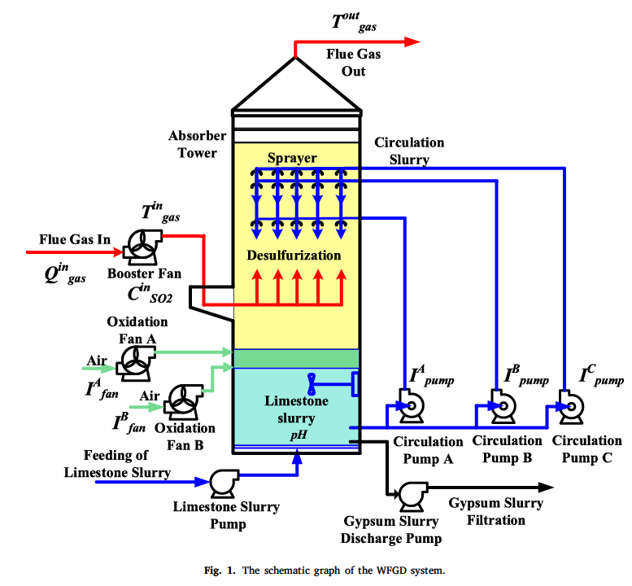
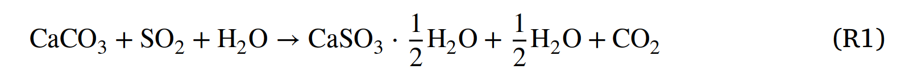
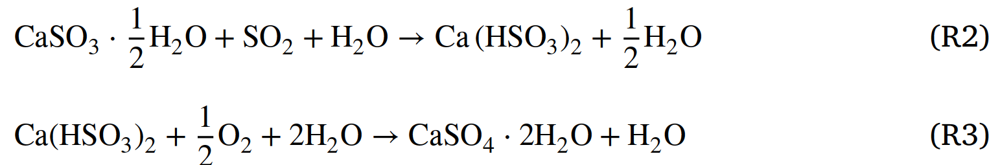
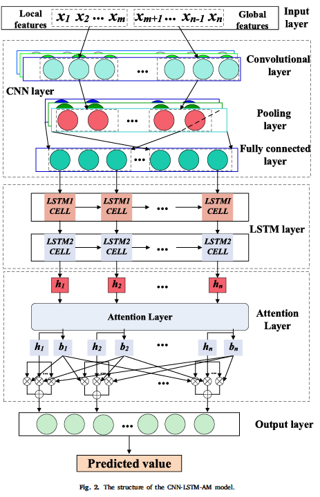

# 基础概念一览
## WFGD（湿法烟气脱硫）
WFGD是“湿法烟气脱硫”（Wet Flue Gas Desulfurization）的缩写。  
大致过程如下：
1.捕捉烟气：当燃煤电厂燃烧煤炭发电时，会产生含有二氧化硫的烟气。这些烟气在排放到大气之前，会被引导进入WFGD系统。
2.石灰石-石膏法：WFGD系统中常用的方法之一是石灰石-石膏法。这个过程中，会使用石灰石（主要成分是碳酸钙）制成的浆液来洗涤烟气。
3.化学反应：石灰石浆液与烟气中的二氧化硫发生化学反应，生成亚硫酸钙，然后进一步被氧化成硫酸钙（石膏）。
4.石膏回收：生成的石膏可以被回收，用于建筑材料等。
5.清洁气体排放：经过这个处理过程后，排放的烟气中二氧化硫的含量大幅降低，达到了环保排放标准，从而减少了对环境的污染。

https://www.bilibili.com/video/BV1pK41197yY/?spm_id_from=333.337.search-card.all.click&vd_source=ef49bd03dc8b04ad8614ac5a7ea86d9c
这个链接是一个约一分钟的视频，比较形象的解释了烟气脱硫塔的结构，结合论文中的图1就比较好理解了。

相关的化学式如下：

## LSTM（长短期记忆网络，Long Short-Term Memory）
这玩意好像内容不少咧。我去学习一下——2024.10.29
ok，已经关于这个水了一个专利了，理解的差不多了，继续来看看论文———2024.11.9

# 文章主体部分
## 综合预测模型（Comprehensive forecast model）
The framework of the proposed model is composed of a CNN module, an LSTM module, and an attention mechanism module.所提出的模型的框架由**一个CNN模块、一个LSTM模块和一个注意力机制模块**组成。

### 数据描述
通常，模型中输入变量的选择由工业过程的机制决定，并且是影响系统输出预测准确性的重要因素。*这个我自己延申一下想的话，如果是对于别的过程应该也是同理，总不能把一些无足轻重的变量都作为输入加进来作为输出吧。*
对于WFGD系统来说，有整体特征变量，比如烟气进口的O~2~浓度、系统消耗功率P、石灰浆浓度D以及浆液的pH值等，以及局部特征参数，如如循环泵A、B、C的输入电机电流等。
对于目标变量，那肯定就是WFGD系统排放的SO~2~浓度咯。

#### 关于数据集
论文中的数据来自于，“研究的WFGD系统的分布式控制系统（DCS）”采样了“影响SO~2~浓度的14个特征变量”，共得到4320组数据用于训练和测试。“采样间隔位1分钟，样本涵盖了锅炉运行历史的三天。”
*备注：分布式控制系统（Distributed Control System，简称DCS）是一种用于工业过程控制的系统，它将整个控制过程分散到多个独立的控制模块中，通过网络将这些模块连接起来，共同完成对生产过程的监控与控制。*
**数据预处理**：训练集中的部分特征变量看你会导致不满意的预测精度，并且冗余变量则会提供过多无价值的信息，使得神经网络训练更加困难。
这里用到了**随机森林（RF，一种集成学习方法）**用于特征选择。

*RF模型没接触过，不太熟，日后有需要也许应该细致学习一下——————2024.11.9*

还有个很重要的知识点**时间序列变量中滞后数的优化**
原因：烟气浓度的波动和燃烧过程固有的性质导致实时SO~2~浓度数据及相关参数观测的时间延迟。
就是说一个输入变量发生变化时，目标变量（出口SO~2~）需要一段时间来相应这种变化。可以通过常识来判断，WFGD是一个具有较大滞后特性的典型系统。
论文中提到了是使用了**ACF（自相关函数）PACF（偏自相关函数）**是广泛用于估计时间序列滞后数

*显然，这个我也不懂啊，草，看来要学的东西还是很多啊，麻了~~~~刚刚去查了一下ACF和PACF在b站几乎没有什么视频，更不必说优秀的科普视频了。也许需要去墙外找找有没有人讲————2024.11.9*
（所以说，这个ACF和PACF应该也是用来预处理数据的吧，把这种滞后给对齐再进行后续的训练。）

## 实验相关

