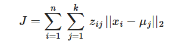

无监督学习的主流两个算法思想，一个是聚类一个是将维度。 
而K-Means均值聚类算法是，应该是最简单经典的聚类算法了。

算法思想（丐版理解（至少我现在最高理解））：
给定固定数量的聚类和一个输入数据集，该算法尝试将数据划分为多个聚类，以使聚类具有高类内相似性和低类间相似性。

目标函数：
给定一组数据点x1……xn，和一个正数k（给定的类的种类），找到集群C1……Ck，来最小化下面的目标函数：

其中，
·zij∈{0，1}决定数据点xi是否属于集群Cj
·μ代表类Cj的类中心
·欧式距离就不必多说了吧~