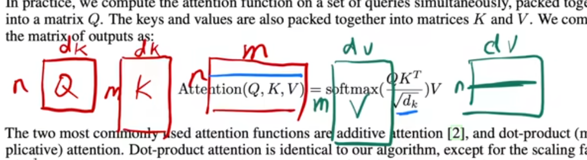
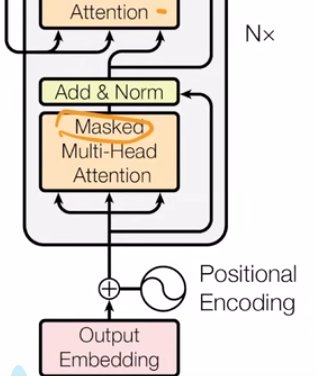
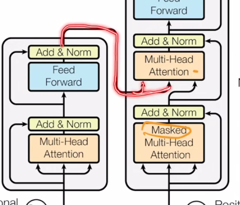
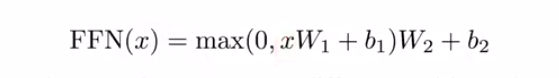
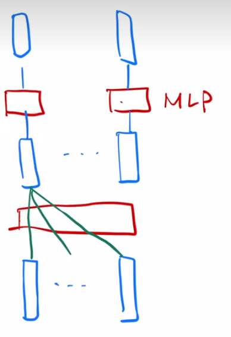

 
上面是transformer的论文结构原图，主要是两个部分，左边为**编码器**，右边为**解码器**。实际应用时，不一定是使用全部。 
#### 对于编码器: 
论文中所说的N=6，当然这个可以调节。为了便利残差连接，将每个layer/sub-layer的输出维度设置为相同的（论文中为d=512） 
 
 

 
这里讲了一个layer_norm的东西（没错，在结构图中的“Add & Norm”的Norm指的就是layer_norm），以及与平时经常使用的batch_norm的区别。见图的左下即为普通的batch_norm，是对于batch中的每个特征向量进行normalization（均值变成0，方差变1）。 
右下即为layer_norm的理解，但结合上面的图比较好理解，是对于每个 样本 来进行normlization。 
  

---
 
这里说了一些注意力机制的东西这里要进行额外的基础知识补全学习了。
## 关于注意力机制： 
注意力函数可以描述为将一个查询（query）和一组键值对（key-value pairs）映射到一个输出的机制。其中，查询、键、值和输出在这个过程中都是向量形式。 
而注意力函数的输出为一个针对value的加权和（所以说输出的维度和value的维度应该是相当的）。 
Q（query）、K（key）、V（value） 
当给出的Q和某些K比较相似的时候，最终输出为将V所有的值加权求和，对应的Q-K比较相像的V中的值在输出时所获得的权重就更高些。 
（额，至少现在我最多就理解到这里的说） 
 

 
 
实际上，不用说也知道，Q可能是矩阵形式的~ 
名字叫Scaled Dot-Product Attention，（加了Scaled是因为除了一个根号下dk）据说是最简单的注意力机制了。。。。 
这里面Q和K矩阵的行向量长度是等长的（都是dk），不过好像现在有很多方法可以做到不等长。 
看下图中左边将Q的行向量与K的行向量做内积（长度相等时，两个向量内积越大，说明二者相似度越高~） 
注意这个公式中是将K矩阵转置后做的Q与K的矩阵相乘，而下图所画的K矩阵是没有进行转置的。 
除以根号dk，用softmax得到各项权重（各项非负，相加为一）。 

 
 
这个图如果方便理解的话，可以首先代入n=1，这样的话看，就是输入一句dk长度的序列，得到一句长度为dv输出。 

 
这是对于Scaled Dot-Product Attention的图示。 
从左下开始看，Q、K两个矩阵，处理后做矩阵乘法。 
而后有个加Mask的选项，之所以加是从时间上考虑的，比如对于t时刻的Q，只想考虑从1到t-1时间的K。 
这里的思路就是待矩阵乘法计算结束之后，将与kt及之后的k计算后的值全部替换为特别大的负数，比如说-1e10，这样的话，后续在softmax中就会变成0，不影响当前时刻啦~ 
  

# 多头注意力机制
 
相比来说就是首先对V、K、Q进行了投影，投影出多个不同的“维度”，图中的Linear层的参数可以进行训练，相比之前的样子可以有更多训练的地方。 
用老师的话来讲，就是好像提供了多个通道一样，按俺的理解的话，就是为模型提供了更多的可能，从而可以应对或者说细化更多的情况~ 
对应公式如下： 
 
这里面的W就对应着各个Linear咯。(W是可以进行学习的) 
论文中令h=8，也就是投影出了八个“通道”，这里长度要注意，多说无益，论文中是这样写的： 
dk=dv=dmodel/h=64 
大概就是这样了 
 
 
---
ok，回到架构图继续进行学习。  
*这里提醒一下，这个初代的transformer有个好处就是输入输出的长度都是一样的，这样去理解的时候可以节约很多成本*  
*然后就这里如何去作为实际理解的话，就是把输入输出都理解成语言。但注意，我们说的输入输出等长，不是指一句话的字符长度，而是一个单词先处理成一个向量（甚至可以理解为长为1的向量），然后在输入输出向量数目相等（单词数量相等）的情况下进行~*

还是先看编码器部分，可以看到从输入进来之后，到第一个多头注意力机制前，  
它分了三个叉，三个叉根据多头注意力那里的图可以理解，就是对应了KVQ。  
**但是要注意一点，这里进来的QKV是相同的，也就是把输入复制成相同的三份而已。**  
 

看解码器遇到的第一个多头注意力机制，是masked。  
暂时结合弹幕是这样理解的，看解码器的部分，它的输入是output embedding也就是  
*（先补充一下这个embedding，嵌入（Embedding）在机器学习中，嵌入是一种将数据（如文本、图像、类别等）转换为固定大小的数值向量的方法。这些向量通常能够捕捉原始数据中的语义或结构信息。）*
前一个时间点的输出，我们希望他作为解码器的本次输入到多头注意力机制的时候，不要考虑当前时间点以后的那些数据。  
除此之外没什么特别好说的，类比上面编码器的那个就可以理解了。 
 

  
重点来了，解码器中走到的第二个多头注意力为上图的重点。  
**图中红色部分表示的是，这里的Key和Value来自的是解码器的输出！**
**而query来自于解码器下方那个多头注意力的输出。**
通俗一点说的话就是，这个多头注意力的作用就是通过解码器前面的输出把编码器的输出中的想要的部分尽可能柃出来（大概就是这个感觉）。  
 

## Feed-Forward是什么东西
就是结构图中的蓝色部分啦，这玩意本质上就是个MLP的集合啦。  

x是一个长为dmodel=512的向量，W1和b1代表由x输入得到隐藏层的权重与偏置，max（0，……）就是一个ReLu激活，W2与b2就是由隐藏层到输出的权重与偏置呗。  
这里要注意的是，中间隐藏层的神经元数量是2048（就是说把长度扩了4倍嘛）。但不要忘记了，初代transformer的设定输入输出等长以及图中的残差连接，都需要这里的输出（FFN(x)）回到512的长度。
**注意这里的每个MLP是分别针对之前多头注意力输出的每个向量中的各项进行的，而不是对整个输出，见下图**

从下往上看，最下面的蓝色是输入的各个向量（被提取好的各个词），遇到的第一个红色就是多头注意力，得到第二层蓝色输出。  
然后，他是针对每一个输出的向量分别有一个MLP来处理从而得到最后的输出。

## Embeddings and Softmax
Embedding和我之前的理解差不多，就是原来的数据都是一个个词（好像可以叫做token），然后要将其学习成为一个个等长（dmodel=512）的向量。  
**文中指出，对应图中的Input Embedding层和Output Embedding层以及Softmax之前的Linear层中的权重是一样的才行**
有关这一点我理解的还不是很到位，关键是我不太理解如何把一个词学成一个向量，还是一个线性层？他的输入应该是什么呢？

值得注意的是，这里在embedding的时候把所得向量的值乘了根号下dmodel。为啥这么做呢？老师的解释是，因为在embedding层中还需要进行L2norm（这个应该指的是归一化的意思吧，因为按照使用L2范数进行正则化来进行权重衰减的理解，我理不通逻辑啊哈哈哈），然后这个向量长度又比较长嘛，你这容易把数都弄太小了，不好做。

## Positional Encoding
*首先理解一个问题就是，注意力机制中是不会注意到时序信息的（因为是各项按权重相加得输出嘛），也就是说不想办法把时序信息加入的话，会有这样的问题，面对我爱你，你爱我，爱你我，这三种输入，最终得到的输出是一样的，这不是扯淡嘛（调侃一下，除非他的输出是滚一边去，劳资不想说爱情的话，还真没问题哈哈哈哈）*