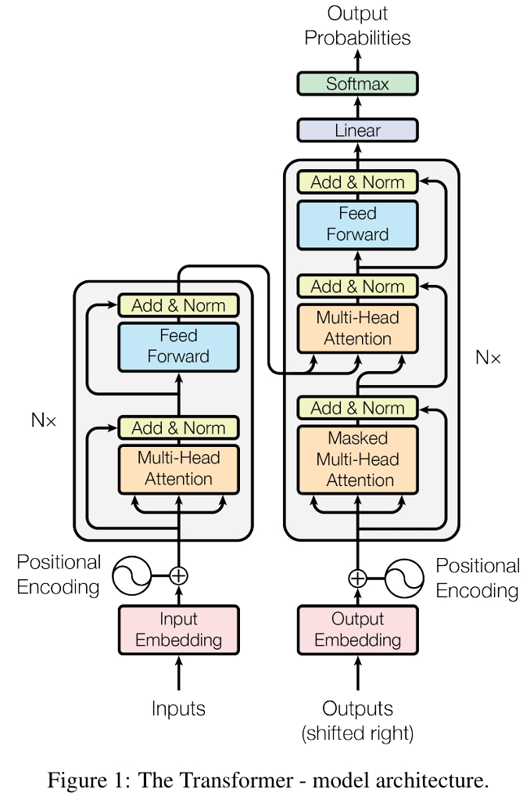
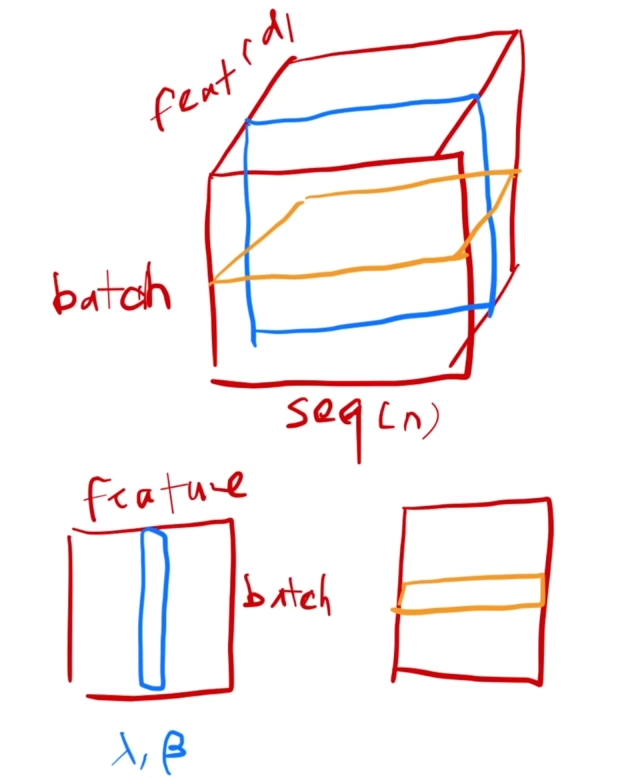
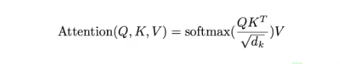
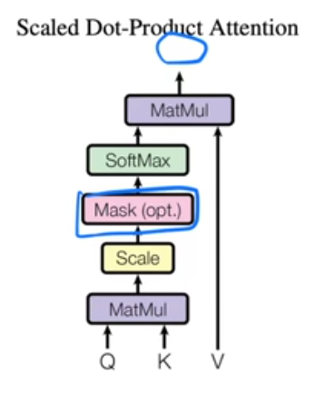
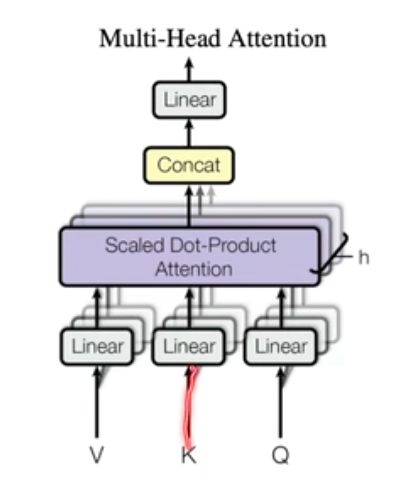
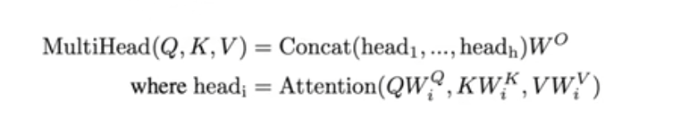

 
上面是transformer的论文结构原图，主要是两个部分，左边为编码器，右边为解码器。实际应用时，不一定是使用全部。 
对于编码器: 
论文中所说的N=6，当然这个可以调节。为了便利残差连接，将每个layer/sub-layer的输出维度设置为相同的（论文中为d=512） 
 
这里讲了一个layer_norm的东西（没错，在结构图中的“Add & Norm”的Norm指的就是layer_norm），以及与平时经常使用的batch_norm的区别。见图的左下即为普通的batch_norm，是对于batch中的每个特征向量进行normalization（均值变成0，方差变1）。 
右下即为layer_norm的理解，但结合上面的图比较好理解，是对于每个 样本 来进行normlization。 
  

这里说了一些注意力机制的东西这里要进行额外的基础知识补全学习了。关于注意力机制： 
注意力函数可以描述为将一个查询（query）和一组键值对（key-value pairs）映射到一个输出的机制。其中，查询、键、值和输出在这个过程中都是向量形式。 
而注意力函数的输出为一个针对value的加权和（所以说输出的维度和value的维度应该是相当的）。 
Q（query）、K（key）、V（value） 
当给出的Q和某些K比较相似的时候，最终输出为将V所有的值加权求和，对应的Q-K比较相像的V中的值在输出时所获得的权重就更高些。 
（额，至少现在我最多就理解到这里的说） 
 
 

 
名字叫Scaled Dot-Product Attention，（加了Scaled是因为除了一个根号下dk）据说是最简单的注意力机制了。。。。 
这里面Q和K矩阵的行向量长度是等长的（都是dk），不过好像现在有很多方法可以做到不等长。 
看图中左边将Q向量与K的行向量做内积（长度相等时，两个向量内积越大，说明二者相似度越高~） 
除以根号dk，用softmax得到各项权重（各项非负，相加为一）。 
实际上，Q可能是矩阵形式的~ 
 
这个图如果方便理解的话，可以首先代入n=1，这样的话看，就是输入一句dk长度的序列，得到一句长度为dv输出。 
 
 
这是对于Scaled Dot-Product Attention的图示。 
从左下开始看，Q、K两个矩阵，处理后做矩阵乘法。 
而后有个加Mask的选项，之所以加是从时间上考虑的，比如对于t时刻的Q，只想考虑从1到t-1时间的K。 
这里的思路就是待矩阵乘法计算结束之后，将与kt及之后的k计算后的值全部替换为特别大的负数，比如说-1e10，这样的话，后续在softmax中就会变成0，不影响当前时刻啦~ 
  
 多头注意力机制 
  
 相比来说就是首先对V、K、Q进行了投影，投影出多个不同的“维度”，图中的Linear层的参数可以进行训练，相比之前的样子可以有更多训练的地方。 
 用老师的话来讲，就是好像提供了多个通道一样，按俺的理解的话，就是为模型提供了更多的可能，从而可以应对或者说细化更多的情况~ 
 对应公式如下： 
  
 这里面的W就对应着各个Linear咯。 
 论文中令h=8，也就是投影出了八个“通道”，这里长度要注意，多说无益，论文中是这样写的： 
 dk=dv=dmodel/h=64 
 大概就是这样了 
 
