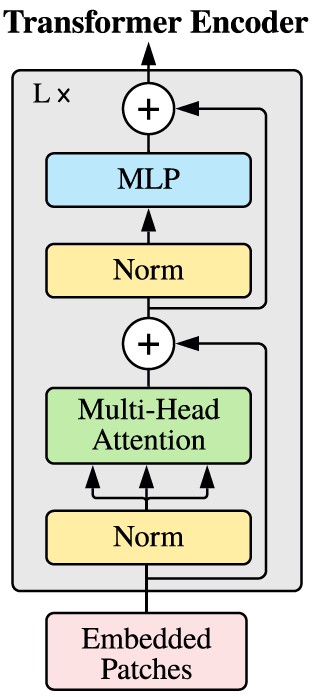

# Vision TransFormer
### 大概印象~
这玩意是动摇了卷积神经网络在计算机视觉领域的绝对统治地位，等于说打通了cv和nlp两个领域的壁垒，开启了cv的新时代~~~
## AN IMAGE IS WORTH 16X16 WORDS:TRANSFORMERS FOR IMAGE RECOGNITION AT SCALE
上面这个是VIT原论文的题目，首先是关于“AN IMAGE IS WORTH 16X16 WORDS”，就是说一张图片，可以将其分为若干个16×16的patch。
“TRANSFORMERS FOR IMAGE RECOGNITION AT SCALE”就是说用TransFormer来做大规模的图像识别。

## 来看看摘要和介绍
摘要中提到，VIT用到的实验资源更小，但其实用的贼多，多到什么程度呢？这么说吧，他把ImageNet视作小的数据集。

## 之前的技术所存在的问题
逻辑是这样的，因为TransFormer的自注意力机制太好用，大家就想把这个用在cv上，于是就遇到大概这两种问题（反正我是这么理解的哈哈哈）：
1.如果直接用TransFormer干，那图像按像素点拉成向量，那输入的序列就太长了，图片小一点的还好，如果稍微大一点，计算量直接就是一个爆炸。
2.如果先用CNN来提取特征，再用TransFormer，这种方法貌似是对于大模型不太适合，就是跑起来难以整太快。

## 大概思路

**简单来说就是，既然一个图片太大，比如说尺寸是224×224，如果我直接搞那输入元素数量就是N=50176，但是如果将其分为若干16×16的patch，将每个patch作为输入，那就只有14×14=196个输入，这样的数量Transformer可以接受**

## 具体方法解析

1. 首先将输入图片分成一个个16×16的patch。
2. 将一个个patch放到线形投射层（其实就是一个全连接层）
3. 将2中所得，拼接额外cls token，并加入位置编码信息
4. 进入TransFormer Encoder

流程图：

举例来说明：（这里省略了残差连接的内容，见图中）
·如果是输入大小为224×224的图片，那么分为16×16的patch可以分出来（224÷16）2=196个，每个patch 的维度就成了16×16×3=768。
·原来的输入就从224×224×3变成了一个196×768的维度。接下来进入线性投射层（论文中给出的维度是768（输入决定）×768（隐藏层神经元个数））
·经过线性投射层得到的结果维度为196×768，也就是196个token，一个token的长度是768
·不过呢，还需要一个可学习的cls token（图中红色圈圈中的内容，应该是用于分类的），其形状为1×768
·将cls token和之前得到的进行拼接，得到形状为197×768的要进入TransFormer的输入。
·在进入TransFormer之前我们还需要给这个输入加上一个位置编码信息
&emsp;对于位置编码嵌入的实现比较特殊且粗暴，在这里简单说一下
&emsp;创建一个等于行数等于patch数的表格，如本例中的196（这里老师没有细讲，不过感觉从操作层面上讲，可能197行会方便一点）。每行长度为768，也就是一个token的长度。这样得到这个196/197×768的矩阵
&emsp;将其直接加到我们之前得到的要进入TransFormer的输入（所得的最终输入形状仍然为197×768）上即可完成位置编码。
&emsp;注意，负责位置编码的这个矩阵是可以进行学习的~~~
·之后进入TransFormer block中，首先是做个LayerNorm
·接下来是做一个多头自注意力机制，得到QKV
&emsp;如果是单头则QKV皆为197×768，多头默认是12个头，则QKV皆为197×64（共12组）
&emsp;经过多头自注意力的结果经过拼接所得的结果仍然为197×768
·再过一层layernorm，再过一个MLP
&emsp;MLP中间的隐藏层的神经元是输入的4倍，也就是768×4=3072个，不过最后还是输出还是197×768
·经过L个TransFormer block（也就是一个Transformer Encoder后），得到的结果过一个分类头（MLP），得到最终的输出。（应该也可以接其他的头，不过现在还没整明白）

### 注意
**对于其中cls token是最终作为整个模型提取的图片的特征输出的。**
可以这样理解，cls token经过很多层的transformer模块后，融合了其他token的信息。
比如说对于接一个MLP图像分类层，只要这个cls token的信息过去接就可以了。
*好像在NLP中也有一样的应用（准确来说VIT加这个就是借鉴了），一句话有很多词，但在一句话前面加一个cls token后，就可以吸取整个句子中的信息，用其代表整个句子。*

但是这个cls token并非绝对必要，论文中指出其实对于vit也可以不用cls token，而像CNN里做的那样，做一个Globally average-pooling，仍然可以提取图像特征。

**对于视觉编码**
Vit使用的是1d的位置编码，就是把图像块patch之间有顺序信息就行。
文中还介绍了2d的位置编码和相对位置编码，好在，最终消融实验的结果表示，都一样，反正TransFormer对这个没那么敏感，你这个位置编码无论哪一种只要有就行。

## 其他
### Data-efficient（数据高效）
老师提到，Vit全局建模能力比较好，相比之下，CNN比较Data-efficient。这个数据高效指的是：能够在较少数据量上实现高性能。
好家伙，第一次接触到这个概念，没想到CNN居然是称得上data efficient的，可见TransFormer相关真是很贵啊-…-。

集合CNN和Vit的长处，可以用CNN来进行分patch的操作，这样相比之下要比直接把图片硬性分出来要看上去科学很多~~~~

### 对于大的图像呢？
对于更大尺寸的图片，微调这不好办啊；其一，保持相同的patch大小的同时，图片尺寸增大，显然会让序列长度变大，虽说TransFormer理论上可以搞多长的序列都行，但对硬件的需求可能就买不起了。第二，序列长度增大，这个之前预训练好的位置编码矩阵就不顶用了啊。
不过文中提到可以使用2d的插值来解决问题2；（听不懂）
老师说，文中的操作就是用torch官方自带的interpolate函数来进行插值。*（插值是一种估计函数在不同点值的技术）*不过，显然插值是不可能想插多长插多长，所以说，这个并不能从根本上解决问题。

### 实验结果摘要
首先就是Vit很nb，然后，最令人印象深刻的一点是Vit在中小型数据集上的效果是比不上ResNet也就是卷积的方法的；不过对于较大的数据集，Vit的效果是可以超越ResNet的~~
但是要不说人家有钱呢，他说的小型数据集，是ImageNet，（真的是让人想骂人，不过这个也侧面说明，也许我的判断没有错，未来如果通讯技术起来了，AI这东西，还是搞垄断的方便）中型数据集是ImageNet-21k，大型数据集是JFT-300M（nnd，三亿图片就离谱）

很离谱的一点是，在同等计算复杂度的情况下（文中只给了102前一点到103后一点的部分），ResNet的效果是比不过Vit的。

**自监督学习**
这里提到了一个如何来自监督训练的方法，就是把这分割好的patch，给它搞上mask。就是说把这些patch随机的抹掉几个，然后通过网络把抹掉的patch生成出来。
然后弹幕里都在刷inpainting。（好像是深度学习中用于修复图像的）

Vit的原始论文只说了针对图像分类的任务，对于目标检测与图像分割的任务没有多说。（如果目标检测任务也可以来个检测头之类的东西就好了）

