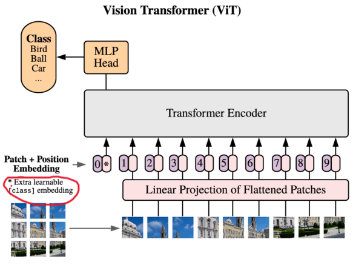

# Vision TransFormer
### 大概印象~
这玩意是动摇了卷积神经网络在计算机视觉领域的绝对统治地位，等于说打通了cv和nlp两个领域的壁垒，开启了cv的新时代~~~
## AN IMAGE IS WORTH 16X16 WORDS:TRANSFORMERS FOR IMAGE RECOGNITION AT SCALE
上面这个是VIT原论文的题目，首先是关于“AN IMAGE IS WORTH 16X16 WORDS”，就是说一张图片，可以将其分为若干个16×16的patch。
“TRANSFORMERS FOR IMAGE RECOGNITION AT SCALE”就是说用TransFormer来做大规模的图像识别。

## 来看看摘要和介绍
摘要中提到，VIT用到的实验资源更小，但其实用的贼多，多到什么程度呢？这么说吧，他把ImageNet视作小的数据集。

## 之前的技术所存在的问题
逻辑是这样的，因为TransFormer的自注意力机制太好用，大家就想把这个用在cv上，于是就遇到大概这两种问题（反正我是这么理解的哈哈哈）：
1.如果直接用TransFormer干，那图像按像素点拉成向量，那输入的序列就太长了，图片小一点的还好，如果稍微大一点，计算量直接就是一个爆炸。
2.如果先用CNN来提取特征，再用TransFormer，这种方法貌似是对于大模型不太适合，就是跑起来难以整太快。

## 大概思路

**简单来说就是，既然一个图片太大，比如说尺寸是224×224，如果我直接搞那输入元素数量就是N=50176，但是如果将其分为若干16×16的patch，将每个patch作为输入，那就只有14×14=196个输入，这样的数量Transformer可以接受**

## 具体方法解析

1.首先将输入图片分成一个个16×16的patch。
2. 

举例来说明：
如果是输入大小为224×224的图片，那么分为16×16的patch可以分出来（224÷16）2=196个
原来的