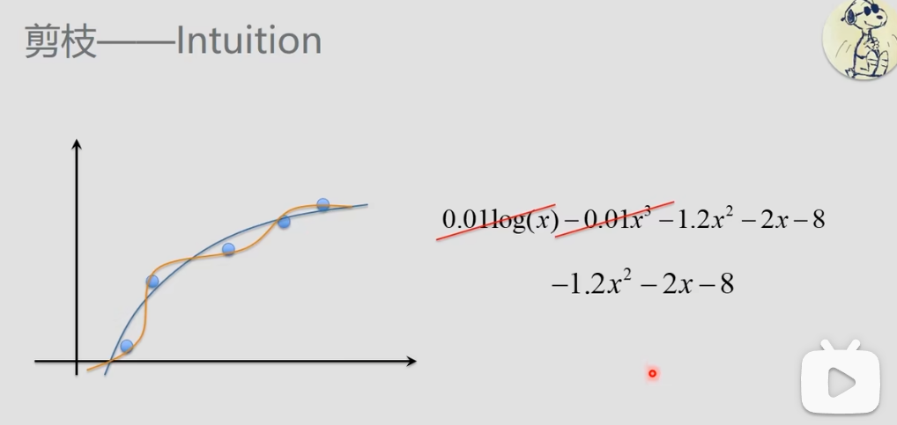
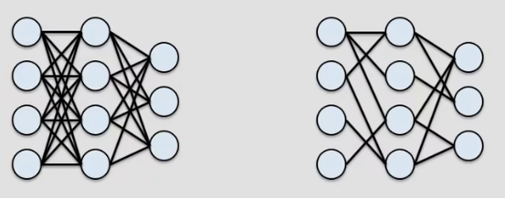
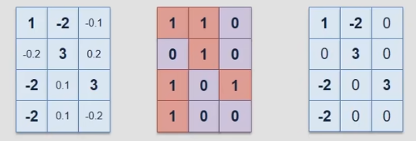
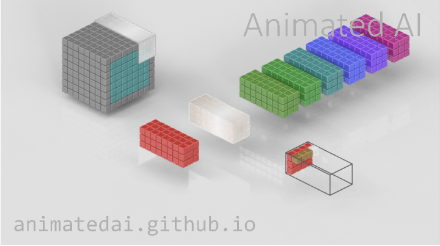

# 剪枝
## MLP（全连接层）

看上图理解，简单来说就是去掉不重要的参数。
下图是全连接进行剪枝的图示：

剪枝的过程就是把一些参数给置零的过程。下图是对应的上图的隐藏层与输出层之间的权重参数的剪枝操作：

左边是未剪枝的权重矩阵，中间是生成一个掩码矩阵，二者进行逐项相乘，最终得到剪枝后的权重矩阵。

## CNN（卷积层）

把这个卷积操作的图放着，省的忘了。
这个东西好像有不少道道，方法挺多的。
其中我最能理解的（其实也是唯一一个我一眼看懂啥意思的），就是挑各个滤波器中权重最小的那些，直接给它权重置零咯（那玩意不就是约等于给删了嘛~）

还有一个东西叫做TinyML的东西这个如果是要搞什么边缘ai的话，应该是很有必要研究一下了QAQ——————2024.10.30